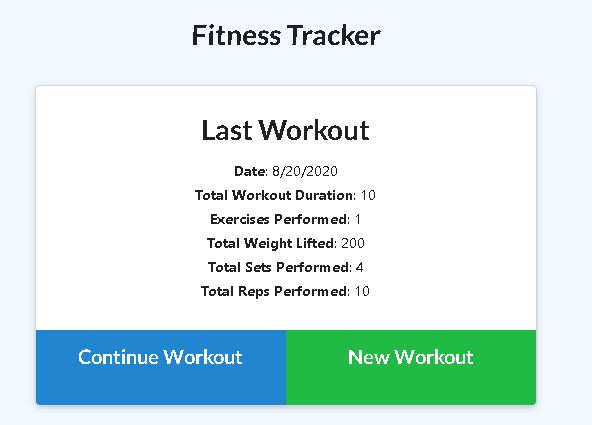

# workouttracker

## Project Title

workouttracker

## Project Link

- https://github.com/jamesrowe1/workouttracker
- https://workouttracker-jamesrowe.herokuapp.com/

## Screenshot

## Getting Started

Begin by navigating to the heroku app website located above. Once there you will be given several options. If you click the "New Workout" button, you will begin a new workout and will be able to enter in details about the workout. If you click "Continue Workout", you will be able to add a new excercise to your current workout.

In the top left corner, you can either come back to the home page by clicking "Fitness Tracker", or go to the Stats dashboard by clicking "Dashboard". On the stats page you will see different charts showing a breakdown on the more recent workouts.

## Prerequisites

You must a working web browswer.

## Built With

- Visual Studio Code
- JavaScript
- Node
  - MongoDB
  - dotenv
  - express
  - mongojs
  - morgan
- Code hosted by Github
- App hosted by Heroku

## Authors

James Rowe

## License

Licensed under Awesome Coding L.L.C. (not a real company)

## Troubleshooting

For any issues contact James Rowe

## Acknowledgments

- Ben Wright
- Justin Pinero
- Wilson Linares